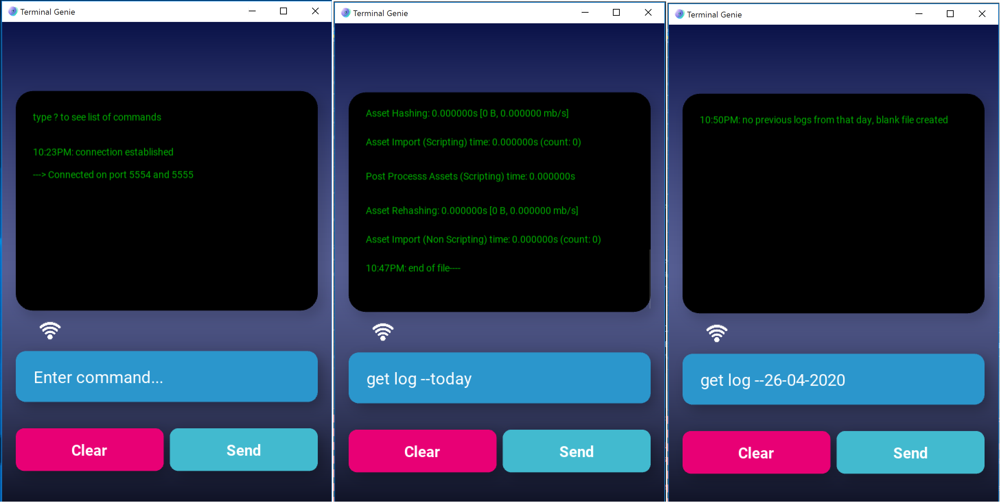
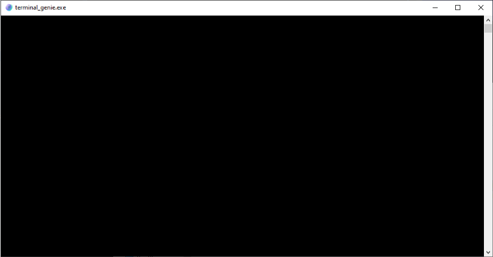

# Terminal Genie
A custom debugging program built for Android version 25.0 and higher to debug Unity projects.
Comes with a remote terminal to run on windows/mac/linux.



---
### 🔵 Application

---
The main application is run on android while the terminal is run from a computer. 
The app will be used in conjunction with the terminal to check for Unity updates but also 
comes with a list of commands to do operations manually. List of commands include:

| Commands                   | Description                                              | 
|----------------------------|----------------------------------------------------------|
| __?__                      | *get list of commands*                                   |         
| __get log__                | *request current log from unity*                         |
| __get log --today__        | *get all logs from today*                                |
| __get log --00-01-2000__   | *get all logs from specific day on *day-month-year**     | 
| __clear logs__             | *delete all temporary log files*                         |
| __clear log --today__      | *delete all logs from today*                             |
| __clear log --00-01-2000__ | *delete log from specific day*                           |

---
#### App Requirements
* *Android Version* - 7.1 and above
* *API/SDK Version* - API Level 25 and above
* *NDK Version* - Latest

---
### 🔵 Terminal

---



##### Windows Versions
The terminal can be run from windows/mac/linux and only prints out any commands sent via the main
application. Commands that come with the terminal will be sent to the **terminal_log.txt** 
file.

The following command can be used with either batch or bash on windows to pipe data
from the terminal:
```shell script
terminal_genie.exe > filename.extension
```
> e.g. terminal_genie.exe > output.txt

##### Mac OS and Linux Versions
Mac and linux distributions will come with a shell (.sh) file called **run.sh** which can be 
run by either right clicking the file and selecting open or by opening a bash terminal and
typing `./run.sh`. In order to pipe data, use the following command `./run.sh > filename.extension`

> ##### :: Important ::
>
> Mac OS and Linux systems should automatically come with python3 installed, however, if this
  is not the case the program will not run. Any version of python3 will work. you can find the
  installers from the main website.
> https://www.python.org/downloads/

---
### Terminal Requirements
* **Unity Version** - 2019.3.10 and above
* **Python3** - any version above 3.7 *(Mac OS and Linux only)*

---
### 🔵 Installation for Developers

---
#### Setting up Python 3
1. Uninstall all versions of python
2. Type into windows search: "*environment variables*" and click on "**Edit the system environment variables**"
3. Go to **ENVIRONMENT VARIABLES > USER VARIABLES > path > EDIT** and then delete all python paths if there is any
_(usually the paths will end with python.exe or python/lib etc.)_
4. Create a new folder at **C:/python**
5. Download the python 3.7.3 installer from https://www.python.org/downloads/
6. Open the installer and choose "*customize installation*" and change these 2 things
    - install in **C:/python** folder
    - tick "**add to environment variables**"
7. Done

#### Setting up the Project
1. clone project to a folder _(don't open in pycharm yet)_
2. in pycharm go to open folder > choose the 3821_WIL folder
   (you'll know it's recognised as a project folder cause the icon will look
    different to a normal folder, if it doesn't then you might need to do step 3)
3. open any .py file in pycharm and look at the top. If it doesn't say you need to add
   an interpreter, skip step 4
4. if it says there's no interpreter, click
   **"add interpreter" > existing interpreter >** open the python.exe file at
   **3821_WIL/app/kivy_venv/Scripts/python.exe** in your project and then press OK.
5. open up a command prompt window (not the one in pycharm) and type: pip install watchdog
6. try running the main.py file within pycharm and it should work
